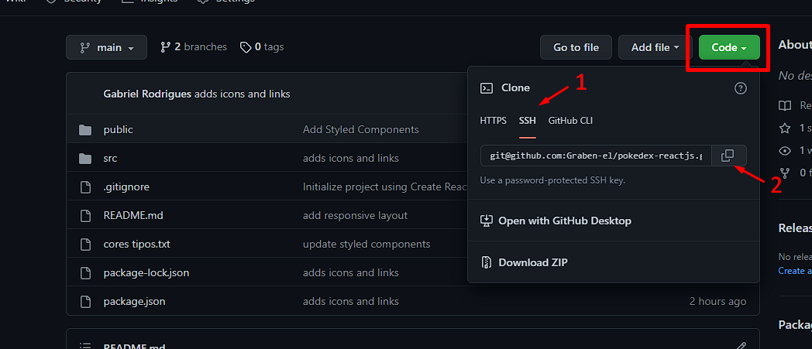

# Pokédex 

## Descrição do projeto

    

        Este projeto é um desafio do curso de desenvolvimento web DevQuest, que tem por objetivo desenvolver uma Single Page Application (SPA) consumindo dados da API PokeAPI, para disponibilizar uma listagem de pokémons e uma página de detalhes sobre suas habilidades, movimentos e tipo.

        
Este projeto deve ser desenvolvido utilizando React JS para criação da Single Page Application, utilizando as libs styled-components, react-router e context.
    

## Tecnologias Utilizadas
<ul style='margin-left: 30px;'>
    <li>React JS;</li>
    <li>Styled Components;</li>
    <li>Context API;</li>
    <li>Gerenciador de Rotas (REACT ROUTER);</li>
    <li>Consumo de API.</li>
</ul>

    <h3>Justificativa:</h3>
    
React JS: esta tecnologia foi escolhida para ser a base do projeto devido aos recursos da biblioteca que permitem a criação de aplicaçãoes de página unica (SPA - Single Page Application). Também está sendo utilizada para exercitar os conhecimentos adquiridos no módulo de React JS do curso DevQuest, além de estimular o aprendizado de novos recursos da tecnologia em recursos implementados

    
Styled Components: utilizado para facilitação da estilização dos elementos react, bem como a criação de estilos componentizados para os recursos disponíveis na aplicação. Além disso, também é conveniente para aplicação de estilos no recurso do alternador de tema escuro e claro, inserindo os estilos através de props passadas aos styled-components criados;

    
Context API: recurso utilizado para criar o recurso de alternar entre temas escuro e claro. Conveniente devido a recursos como Theme Provider, que permite transmitir aos componentes da aplicação, através de props, os estilos alternativos para cada versão da página;

    
React Router: utilizado para criação da estrutura de SPA, que é a principal proposta do projeto;

    
Consumo de API: neste projeto foi utilizado a API PokeAPI que é um banco de dados com as informações individuais de cada pokémon, de onde os dados são buscados e atualizados automaticamente via JavaScript Assíncrono

## Estágio atual do projeto

Atualmente o projeto se encontra <u>CONCLUÍDO</u>.

    

## Recursos disponíveis na aplicação:

<ul>
    <li>Página inicial com card de pokémons com nome e tipo e botão "Show More" que adiciona mais pokémons à página;</li>
    <li>Página de detalhe individual para cada pokémon, relacionando seu nome, estatiticas, tipo, movimentos e habilidades;</li>
    <li>Tela de 'Loading' ao aguardar respostas da API;</li>
    <li>Estilização da Página de Detalhes;</li>
    <li>Estatisticas, movimentos e habilidades com descrição;</li>
    <li>Estilização do Layout externo e da página inicial;</li>
        <ul>
            <li>Botões Home, Theme-Toggler, Github e Linkedin funcionais;
            <li>Lanterna (canto superior esquerdo) que substitui o botão Theme-Toggler em resoluções mobile;
        </ul>
    <li>Layout Responsivo.</li>
</ul>

## Como Iniciar o Projeto Localmente

Para você poder utilizar a pokédex existem duas alternativas: 1) acessando a página no github pages <a href='https://graben-el.github.io/pokedex-reactjs/'> clicando aqui</a>, ou 2) iniciando o projeto localmente em seu computador.

    <h3>Iniciando o projeto localmente:</h3>
    <ol>
        <li> Na página inicial do repositório do projeto clique no botão verde escrito 'Code':
            

                <ul>
                    <li>Clique na opção de SSH e copie o código clicando no botão de copiar</li>
                </ul>
                
            

        <li> Abra a pasta onde deseja salvar a pasta do projeto através do Prompt De Comando e execute o comando:  
        <code style='margin-left: 40px;'> git clone [ insira aqui o código ssh copiado no repositorio (excluindo os [] ) ] </code>  
        <li>Finalizado o download dos arquivos no seu computador, ainda no prompt de comando ou no terminal do Visual Studio Code (ou seu editor de código) digite o comando a seguir para instalação das dependências necesárias para rodar o projeto:  
        <code style='margin-left: 40px;'> npm install </code>  
        <li> Após finalizado o processo de instalação digite o comando a seguir para iniciar o projeto em seu navegador padrão:  
        <code style='margin-left: 40px;'> npm start </code>  
    </ol>

## Processo de Desenvolvimento do Projeto

### Premissa Inicial

Inicialmente, o projeto desafio proposto deveria contemplar os seguintes pontos:

<ul>
    <li>A aplicação dever ser Single Page Application (SPA);
    <li>Utilizar React.js para o desenvolvimento da
    aplicação;
    <li>Utilizar Context API para criação do Theme Toggler
    (Alternador entre tema claro e escuro);
    <li>Utilizar styled-components para estilização dos
    componentes;
    <li>Utilizar react-router-dom para a navegação entre as
    páginas;
</ul>

Além disso, era permitido também a implementação de novos recursos como filtros e animações de acordo com a ideia final do projeto

### Recursos adicionais implementados:

Os recursos adicionais que foram implementados por mim foram o layout de console portátil e algumas novas informações sobre o pokemon.

Para o layout de console portátil, foi implementado os estilos que simulam o console, que inclui os botões à direita com recursos como Home, Theme-Toggler e links para as redes sociais do autor e um d-pad ilustrativo à esquerda da tela de exibição de informações. Este layout é estático externamente, contendo como elemento dinâmico apenas a "tela" do console que exibe as informações consumidas da API.

As únicas informações extras inseridas são as estatisticas (pontos de vida, velocidade e etc) do pokémon, introduzidas com o objetivo de trazer informações mais completas ao usuário.

### Estruturação do Projeto:

O projeto foi todo construído a partir da componentização de cada elemento dentro dele, de tal forma que os componentes sejam facilmente encontrados nos arquivos do projeto e manutenidos de forma independente. Isso inclui também a criação de arquivos individuais em pastas especificas para estilos, rotas, services e variáveis, mantendo os componentes principais do projeto isolados e incluindo apenas o necessário a partir de importações.

