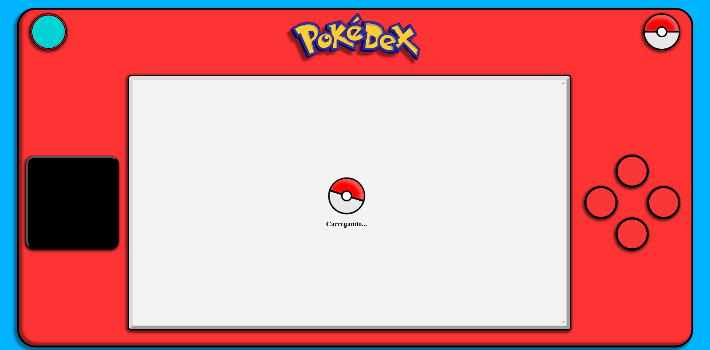

# Pokédex (em desenvolvimento)

## Tecnologias Utilizadas
<ul>
    <li>React JS: Renderização e Consumo de dados da PokeAPI</li>
    <li>Styled Components: estilização dos componentes REACT</li>
    <li>Context API: implementação do Alternador de Tema da Página (ainda não implementado)</li>
    <li>Gerenciador de Rotas (REACT ROUTER): renderização da pagina em SPA</li>
    <li>Consumo de API: obtenção de dados da PokeAPI</li>
</ul>

## Descrição do projeto

Este projeto é um desafio do curso de desenvolvimento web DevQuest, que tem por objetivo desenvolver uma Single Page Application (SPA) consumindo dados da API PokeAPI, para disponibilizar uma listagem de pokémons e uma página de detalhes sobre suas habilidades, movimentos e tipo.

Este projeto deve ser desenvolvido utilizando React JS para criação da Single Page Application, utilizando as libs styled-components, react-router, context API e redux.

## Estágio atual do projeto

Atualmente o projeto se encontra EM DESENVOLVIMENTO.

    
    

    <h2 style='text-align: left;'>Layout Responsivo:</h2>
    

## Recursos já implementados

<ul>
    <li>Página inicial com card de pokémons com nome e tipo e botão "Show More" que adiciona mais pokémons à página;</li>
    <li>Página de detalhe individual para cada pokémon, relacionando seu nome, tipo, movimentos e habilidades;</li>
    <li>Tela de 'Loading' ao aguardar respostas da API;</li>
    <li>Estilização da Página de Detalhes;</li>
    <li>Estatisticas, movimentos e habilidades com descrição;</li>
    <li>Estilização do Layout externo e da página inicial</li>
    <li>Layout Responsivo</li>
</ul>

## Recursos a serem implementados em breve
<ul>
    <li>Alternador de Tema escuro/Tema Claro</li>
</ul>
